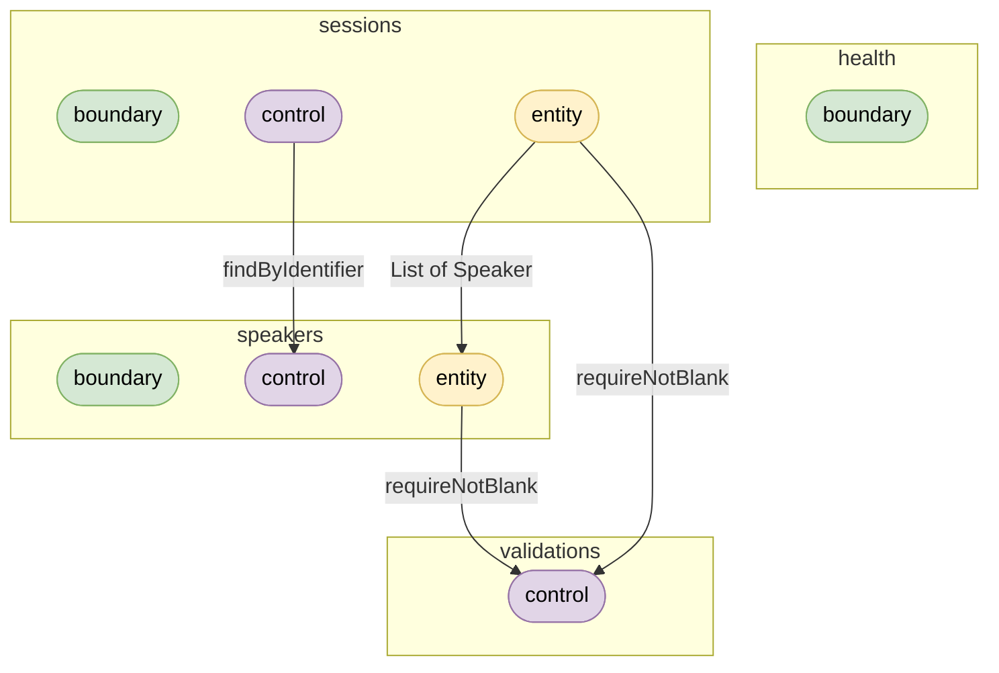

# confex - Conference Management

Conference management built on Quarkus and MicroProfile. Domain (sessions, speakers) is modeled after [schema.org/Event](https://schema.org/Event) and [schema.org/Person](https://schema.org/Person). BCE-structured: JAX-RS resources at the boundary, JSON-P for serialization, CDI throughout, MicroProfile-only dependencies.

Based on 👉 [quarkus-microprofile](https://github.com/adambien/quarkus-microprofile) template | BCE-structured 👉 [bce.design](https://bce.design) | AI-assisted with 👉 [airails.dev](https://airails.dev)

## Architecture

BCE-structured: each Business Component (BC) groups its own boundary (JAX-RS), control (logic), and entity (domain/state) packages.

## Getting Started

See [AGENTS.md](AGENTS.md#build--test) for build, dev mode, and system test instructions.

## Modules

- [service](service/README.md) - Quarkus service module
- [service-st](service-st/README.md) - System tests for the service module

Powered by [airhacks.live](https://airhacks.live)
